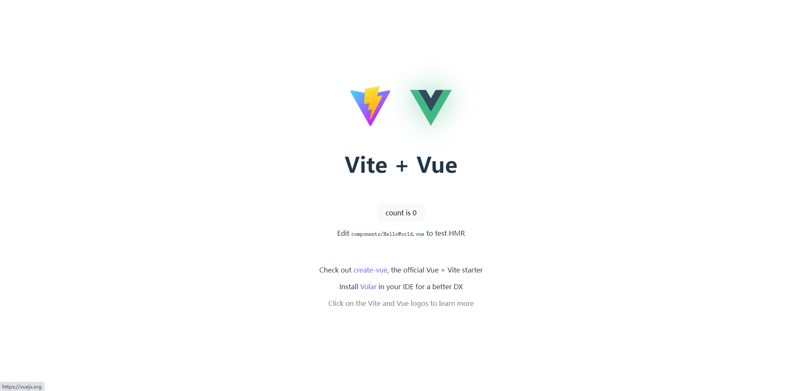

<script setup>
</script>
# Typescript核心特性

## 技术栈:

- Vite5.x
- Vue3.x
- Typescript5.x

## 项目初始化

- 首先，我们通过阅读 vite 官网（https://cn.vitejs.dev/guide/） 创建初始项目，
  我这里使用的是 pnpm 安装的方式。按照以下命令运行：

```typescript
pnpm create vite
project name: vite-vue3-ts-admin
Vue
Typescript
cd vite-vue3-ts-admin
pnpm install
pnpm run dev
```

- 如下图：然后我们可以看到启动成功，显示下图的页面。




<style lang="scss" scoped>
@import "@/assets/styles/common.scss";

</style>
