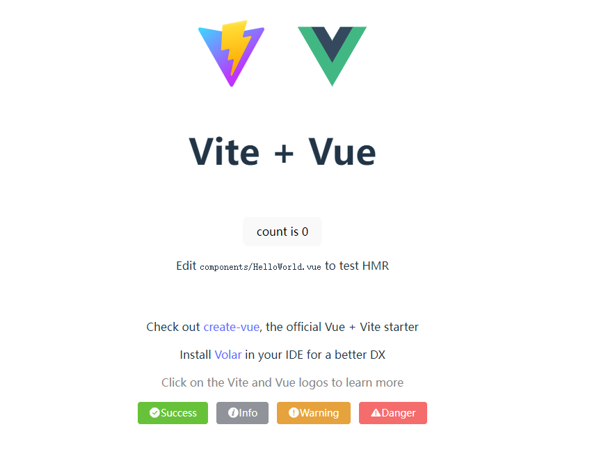

<script setup>
import { ref } from 'vue'

const count = ref(250)
</script>

<div v-if="false">{{ count }}</div>

# Vite + Vue3 + ElementUI + Typescript 开发后台管理系统

## 技术栈:

- Vite5.x
- Vue3.x
- Typescript5.x

## 项目初始化

- 首先，我们通过阅读 vite 官网（https://cn.vitejs.dev/guide/） 创建初始项目，
  我这里使用的是 pnpm 安装的方式。按照以下命令运行：

```typescript
pnpm create vite
project name: vite-vue3-ts-admin
Vue
Typescript
cd vite-vue3-ts-admin
pnpm install
pnpm run dev
```

- 如下图：然后我们可以看到启动成功，显示下图的页面。


## 环境配置

- 开发工具：vscode
- vscode 插件安装 Vue - Official，然后禁止 vetur


## 路径别名配置

- 配置 vite.config.ts ，代码如图所示：


- 运行以后，发现报错 path is not defined，本地安装 Node 的 TypeScript 类型描述文件即可解决编译器报错。

```typescript
pnpm i @types/node -D
```

- 现在，我们试用一下刚刚配置的别名功能是否生效

```typescript
// src/App.vue
import HelloWorld from '/src/components/HelloWorld.vue'
						↓
import HelloWorld from '@/components/HelloWorld.vue'
```


- 上面是配置 vue 文件里面的路径名解析，接下来我们配置一下 TS 文件的路径解析

<p>tsconfig.json中，我们加入下列配置，然后可以发现能正常解析路径映射了</p>

```typescript
{
  "compilerOptions": {
    "allowImportingTsExtensions": true,
    "paths": {
      //路径映射，相对于baseUrl
      "@/*": ["src/*"]
    }
  }
}
```


## Unplugin 自动导入

- 现在主流项目中都是提倡按需导入，优点是可以减少无用资源引入，避免资源重复引入。缺点是每次按需引入时，需要手动引入。
  所以这里我们使用 unplugin 自动导入，解放双手。

<table>
  <thead>
    <tr>
      <th>插件</th>
      <th>概念</th>
      <th>自动导入对象</th>
    </tr>
  </thead>
  <tbody>
    <tr>
      <td>unplugin-auto-import</td>
      <td>按需自动导入API</td>
      <td>ref，reactive,watch,computed 等API</td>
    </tr>
    <tr>
      <td>unplugin-vue-components</td>
      <td>按需自动导入组件</td>
      <td>Element Plus 等三方库和指定目录下的自定义组件</td>
    </tr>
  </tbody>
</table>

开始安装：

```typescript
pnpm install -D unplugin-auto-import unplugin-vue-components

```

- 然后在 vite.config.ts 配置属性

```typescript
import { defineConfig } from "vite";
import vue from "@vitejs/plugin-vue";
import path from "path";
import AutoImport from "unplugin-auto-import/vite";
import Components from "unplugin-vue-components/vite";

const { resolve } = path;
const pathSrc = resolve(__dirname, "src");
// https://vitejs.dev/config/
export default defineConfig({
  plugins: [
    vue(),
    AutoImport({
      // 自动导入 Vue 相关函数，如：ref, reactive, toRef 等
      imports: ["vue"],
      eslintrc: {
        enabled: true, // 是否自动生成 eslint 规则，建议生成之后设置 false
        filepath: "./.eslintrc-auto-import.json", // 指定自动导入函数 eslint 规则的文件
      },
      dts: resolve(pathSrc, "types", "auto-imports.d.ts"), // 指定自动导入函数TS类型声明文件路径
    }),
    Components({
      dts: resolve(pathSrc, "types", "components.d.ts"), // 指定自动导入组件TS类型声明文件路径
    }),
  ],
  resolve: {
    alias: {
      "@": pathSrc,
    },
  },
});
```

- 如下图所示，我们删除引入 ref 和引入组件的代码。发现，项目并没有报错，至此，我们成功的实现了按需自动引入 API、组件


- .eslintrc.cjs - 自动导入函数 eslint 规则引入（稍后在配置 eslint 的时候配置该选项）

```typescript
"extends": [
    "./.eslintrc-auto-import.json"
],
```

- tsconfig.json - 自动导入 TS 类型声明文件引入

```typescript
{
  "include": ["src/**/*.d.ts"]
}
```

## Element Plus 按需自动导入

在 unplugin 安装以后，我们可以开始按需自动导入 element plus 了

```typescript
pnpm i element-plus
```

- 安装自动导入 Icon 图标，该插件提供多个图标库（https://icon-sets.iconify.design/） 、自动下载图标库、自动导入图标、自动注册图标等功能。
  element-plus 的图标库也被收集在依赖内。

```typescript
pnpm i -D unplugin-icons
```

- 到这一步时，我们的配置如下：

```typescript
import { defineConfig } from "vite";
import vue from "@vitejs/plugin-vue";
import path from "path";
import AutoImport from "unplugin-auto-import/vite";
import Components from "unplugin-vue-components/vite";
import { ElementPlusResolver } from "unplugin-vue-components/resolvers";
import Icons from "unplugin-icons/vite";
import IconsResolver from "unplugin-icons/resolver";

const { resolve } = path;
const pathSrc = resolve(__dirname, "src");
// https://vitejs.dev/config/
export default defineConfig({
  plugins: [
    vue(),
    AutoImport({
      // 自动导入 Vue 相关函数，如：ref, reactive, toRef 等
      imports: ["vue"],
      eslintrc: {
        enabled: true, // 是否自动生成 eslint 规则，建议生成之后设置 false
        filepath: "./.eslintrc-auto-import.json", // 指定自动导入函数 eslint 规则的文件
      },
      dts: resolve(pathSrc, "types", "auto-imports.d.ts"), // 指定自动导入函数TS类型声明文件路径
      resolvers: [
        // 自动导入 Element Plus 相关函数，如：ElMessage, ElMessageBox... (带样式)
        ElementPlusResolver(),
        // 自动导入图标组件
        IconsResolver({}),
      ],
      vueTemplate: true, // 是否在 vue 模板中自动导入
    }),
    Components({
      dts: resolve(pathSrc, "types", "components.d.ts"), // 指定自动导入组件TS类型声明文件路径
      resolvers: [
        // 自动导入 Element Plus 组件
        ElementPlusResolver(),
        // 自动注册图标组件
        IconsResolver({
          enabledCollections: ["ep"], // element-plus图标库，其他图标库 https://icon-sets.iconify.design/
        }),
      ],
    }),
    Icons({
      // 自动安装图标库
      autoInstall: true,
    }),
  ],
  resolve: {
    alias: {
      "@": pathSrc,
    },
  },
});
```

- 添加 element 组件及 icon

```html
<!-- src/components/HelloWorld.vue -->
<div>
  <el-button type="success"><i-ep-SuccessFilled />Success</el-button>
  <el-button type="info"><i-ep-InfoFilled />Info</el-button>
  <el-button type="warning"><i-ep-WarningFilled />Warning</el-button>
  <el-button type="danger"><i-ep-WarnTriangleFilled />Danger</el-button>
</div>
```

- 预览效果
  

## vite-plugin-svg-icons 生产 SVG 雪碧图

- 相关文档：[vite-plugin-svg-icons](https://github.com/vbenjs/vite-plugin-svg-icons/blob/main/README.zh_CN.md)

- 安装 vite-plugin-svg-icons

```typescript
pnpm i -D vite-plugin-svg-icons
```

- 创建 src/assets/icons 目录 , 随便下载一个 svg 图标放入。

- 按照文档描述，在 main.ts 中引入注册脚本

```typescript
// src/main.ts
import "virtual:svg-icons-register";
```

- vite.config.ts 配置插件

```typescript
import { createSvgIconsPlugin } from "vite-plugin-svg-icons";
const { resolve } = path;
export default defineConfig({
  plugins: [
    createSvgIconsPlugin({
      // 指定需要缓存的图标文件夹
      iconDirs: [resolve(process.cwd(), "src/assets/icons")],
      // 指定symbolId格式
      symbolId: "icon-[dir]-[name]", // dir是以iconDirs作为根目录，下面的子目录。name是文件名
    }),
  ],
});
```

- SvgIcon 组件封装

```vue
<!-- src/components/SvgIcon/index.vue -->
<script setup lang="ts">
const props = defineProps({
  prefix: {
    type: String,
    default: "icon",
  },
  iconClass: {
    type: String,
    required: false,
  },
  color: {
    type: String,
  },
  size: {
    type: String,
    default: "1em",
  },
});

const symbolId = computed(() => `#${props.prefix}-${props.iconClass}`);
</script>

<template>
  <svg
    aria-hidden="true"
    class="svg-icon"
    :style="'width:' + size + ';height:' + size"
  >
    <use :xlink:href="symbolId" :fill="color" />
  </svg>
</template>

<style scoped>
.svg-icon {
  display: inline-block;
  outline: none;
  width: 1em;
  height: 1em;
  vertical-align: -0.15em; /* 因icon大小被设置为和字体大小一致，而span等标签的下边缘会和字体的基线对齐，故需设置一个往下的偏移比例，来纠正视觉上的未对齐效果 */
  fill: currentColor; /* 定义元素的颜色，currentColor是一个变量，这个变量的值就表示当前元素的color值，如果当前元素未设置color值，则从父元素继承 */
  overflow: hidden;
}
</style>
```

- 组件使用

```vue
<!-- src/components/HelloWorld.vue -->
<template>
  <div style="margin-top: 20px; background-color: bisque;">
    <svg-icon icon-class="doge" size="5em" />
    <div>SVG 本地图标</div>
  </div>
</template>
```


## Scss 安装

```typescript
pnpm i -D sass
```

- 创建 src/styles/variables.scss 变量文件，添加变量 $bgColor 定义，注意规范变量以 $ 开头

```typescript
// src/styles/variables.scss
$red: red;
```

- vite 配置导入 scss 全局变量文件

```typescript
css: {
  // CSS 预处理器
  preprocessorOptions: {
    //define global scss variable
    scss: {
      javascriptEnabled: true,
      additionalData: `@use "@/styles/variables.scss" as *;`
    }
  }
}
```

- style 标签使用 scss 全局变量

```typescript
<template>
  <div style="margin-top: 20px; background-color: bisque;">
    <svg-icon icon-class="doge" size="5em"/>
    <div class="red">SVG 本地图标</div>
  </div>
</template>

<style lang="scss" scoped>
.red{
  color: $red;
}
</style>
```

- 上面导入的 scss 全局变量在 typeScript 不生效的，可以通过在文件扩展名前加上 .module 来结合使用 CSS modules 和预处理器，例如 src/styles/variable.module.scss

```scss
// 导出 variable.scss 文件的变量
:export {
  $bgColor: $bgColor;
}
```

- 然后在 typeScript 里面，引入该变量并且使用，如下图

```typescript
<script setup lang="ts">
import variable from "@/styles/variable.module.scss";
</script>

<template>
  <div :style="{'margin-top': '20px', 'background-color': variable.$bgColor}">
    <svg-icon icon-class="doge" size="5em"/>
    <div class="red">SVG 本地图标</div>
  </div>
</template>
```


- 重置标准样式

<p>这里使用了reset.css，重置常用标签的属性，然后将上方的variable.scc也一并引入index.scss。</p>

```ts
export default defineConfig({
  css: {
    // CSS 预处理器
    preprocessorOptions: {
      //define global scss variable
      scss: {
        javascriptEnabled: true,
        additionalData: `@use "@/styles/index.scss" as *;`,
      },
    },
  }
})

```


## Unocss 安装

<p>即时按需原子 CSS 引擎</p>

- 安装 UnoCSS

```typescript
pnpm i -D unocss
```

- vite.config.ts 配置

```typescript
// vite.config.ts
import UnoCSS from "unocss/vite";
import { defineConfig } from "vite";

export default defineConfig({
  plugins: [UnoCSS()],
});
```

- 根目录创建 uno.config.ts 文件

```typescript
//uno.config.ts
import { defineConfig } from "unocss";
export default defineConfig({
  // ...UnoCSS options 具体配置可以查看unocss官网文档
  rules: [
    ["blue", { color: "blue" }],
    ["ft20", { "font-size": "20px" }],
  ],
  shortcuts: {
    "ft20-blue": "blue ft20",
  },
});
```

- 入口文件 main.ts 中引入 UnoCSS 样式文件

```typescript
// main.ts
import "virtual:uno.css";
```

- VSCode 安装 UnoCSS 插件，然后可以写一点测试代码，比如改变字体颜色，效果如下图所示：

```vue
// src/components/HelloWorld.vue
<template>
  <div class="blue">SVG 本地图标</div>
  <div class="ft20-blue">SVG 本地图标2</div>
</template>
```


## Pinia 安装

<p>Pinia 是 Vue 的专属状态管理库，它允许你跨组件或页面共享状态。可以理解成一个中心数据状态仓库。</p>
- 安装Pinia

```typescript
pnpm i pinia
```

- main.ts 引入 pinia

```typescript
// src/main.ts
import { createPinia } from "pinia";
import App from "./App.vue";

createApp(App).use(createPinia()).mount("#app");
```

- 定义 store

<p>Store 定义分为选项式和组合式，在vue3项目中，一般推荐的是使用组合式的方式组织代码，所以这里我们选择组合式，保持项目代码风格统一。</p>

<p>新建文件 src/store/index.ts，创建store。</p>

```typescript
import type { App } from "vue";
import { createPinia } from "pinia";

const store = createPinia();

// 全局注册 store
export function setupStore(app: App<Element>) {
  app.use(store);
}

export * from "./app";

export { store };
```

<p>新建文件 src/store/app.ts，注册了store以后，我们以组合式函数的风格来定义一个store的状态。在 Setup Store 中：</p>
<p>在 Setup Store 中：</p>
<ul>
  <li>ref() 就是 state 属性</li>
  <li>computed() 就是 getters</li>
  <li>function() 就是 actions</li>
</ul>

```typescript
import { defineStore } from "pinia";
export const useCounterStore = defineStore("counter", () => {
  // ref变量 → state 属性
  const count = ref(0);
  // computed计算属性 → getters
  const double = computed(() => {
    return count.value * 2;
  });
  // function函数 → actions
  function increment() {
    count.value++;
  }

  return { count, double, increment };
});
```

- 使用 store

<p>在父组件src/App.vue，和子组件src\components\HelloWorld.vue中分别引入useCounterStore，并使用。可以发现他们的getters是变化一致的。</p>

<p>父组件：</p>

```typescript
<script setup lang="ts">
import { useCounterStore } from "@/store/index"
const counterStore = useCounterStore();
</script>

<template>
  <div class="card">
    <p>父元素元素：</p>
    <button type="button" @click="counterStore.increment">actions: increment</button>
    <p>state: {{ counterStore.count }}</p>
    <p>getters: {{ counterStore.double }}</p>
  </div>
  <HelloWorld msg="Vite + Vue" />
</template>
```

<p>子组件：</p>

```typescript
<script setup lang="ts">
import variable from "@/styles/variable.module.scss";
import { useCounterStore } from "@/store/index"
defineProps<{ msg: string }>();
const counterStore = useCounterStore();
</script>

<template>
  <div class="card">
    <p>子元素：</p>
    <button type="button" @click="counterStore.increment">actions: increment</button>
    <p>state: {{ counterStore.count }}</p>
    <p>getters: {{ counterStore.double }}</p>
  </div>
</template>
```

<p>上述代码中删除了一些非必要代码，仅保留了一些核心代码，效果如下图：</p>


## 环境变量配置

- 环境变量配置

<p>与webpack项目类型，在根目录新建 .env.development 、.env.production等文件配置开发、测试、生产等环境变量，具体详情可查看[vite环境变量](https://cn.vitejs.dev/guide/env-and-mode)</p>
<p>这里，我们只配置两个环境，开发、生产作为演示。</p>

<p>开发环境变量配置（.env.development）</p>

```typescript
# 变量必须以 VITE_ 为前缀才能暴露给外部读取
VITE_APP_TITLE = 'vue3-element-admin'
VITE_APP_PORT = 3000
VITE_APP_BASE_API = '/dev-api'
```

<p>生产环境变量配置（.env.development）</p>

```typescript
VITE_APP_TITLE = "vite-vue3-ts-admin";
VITE_APP_PORT = 4000;
VITE_APP_BASE_API = "/prod-api";
```

- 环境变量智能提示

<p>新建 src/types/env.d.ts文件，存放环境变量TS类型声明</p>

```typescript
// src/types/env.d.ts
interface ImportMetaEnv {
  /**
   * 应用标题
   */
  VITE_APP_TITLE: string;
  /**
   * 应用端口
   */
  VITE_APP_PORT: number;
  /**
   * API基础路径(反向代理)
   */
  VITE_APP_BASE_API: string;
}

interface ImportMeta {
  readonly env: ImportMetaEnv;
}
```

<p>然乎我们在App.vue里面打印一个环境变量，可以看到智能提示。</p>


## 反向代理跨域

<p>浏览器同源策略: 协议、域名和端口都相同是同源，浏览器会限制非同源请求读取响应结果。</p>
<p>我们在开发环境中，通过proxy设置跨域，vite会在本地启动一个node服务，中转请求，从而避免浏览器的同源策略。因为服务端请求服务端是没有浏览器的同源限制的。</p>
<p>在vite.config.ts文件中配置代理</p>

```typescript
server: {
  proxy: {
    '/api': {
      target: 'http://www.path2.com',
      changeOrigin: true,
      rewrite: (path) => path.replace(/^\/api/, '/api/v1/'),
    },
  }
}
```

<p>配置以后，地址会进行重写转化：</p>
<p class="flex"><strong class="w120">请求地址：</strong><span>http://www.path1.com/api/getList/api/</span></p>
<p class="flex"><strong class="w120">转后后的地址：</strong><span>http://www.path2.com/getList/api/v1/</span></p>

## Axios 安装

<p>安装依赖</p>

```typescript
pnpm i axios
```

<p>新建src/utils/request.ts，阅读<a href="https://axios-http.com/zh/docs/intro">axios官网文档</a>，写入以下配置</p>

```typescript
//InternalAxiosRequestConfig是axios的内部API
import axios, { InternalAxiosRequestConfig, AxiosResponse } from "axios";

// 创建 axios 实例
const service = axios.create({
  baseURL: import.meta.env.VITE_APP_BASE_API,
  timeout: 60000,
  headers: { "Content-Type": "application/json;charset=utf-8" },
});

// 请求拦截器
service.interceptors.request.use(
  (config: InternalAxiosRequestConfig) => {
    config.headers.Authorization = "token";
    return config;
  },
  (error: any) => {
    return Promise.reject(error);
  }
);

// 响应拦截器
service.interceptors.response.use(
  (response: AxiosResponse) => {
    // 检查配置的响应类型是否为二进制类型（'blob' 或 'arraybuffer'）, 如果是，直接返回响应对象
    if (
      response.config.responseType === "blob" ||
      response.config.responseType === "arraybuffer"
    ) {
      return response;
    }

    const { code, data, msg } = response.data;
    if (code >= 200 && code < 300) {
      return data;
    }

    console.log(msg || "系统出错");
    return Promise.reject(new Error(msg || "Error"));
  },
  (error: any) => {
    // 异常处理
    if (error.response.data) {
      const { code, msg } = error.response.data;
      if (code >= 500) {
        console.log(msg || "系统出错");
      }
    }
    return Promise.reject(error.message);
  }
);

// 导出 axios 实例
export default service;
```

<p>新建src/api/common.ts，调用API</p>

```ts
// src/api/common.ts
import request from "@/utils/request";

// 登录
export function login(data) {
  return request({
    url: "/api/user/login",
    method: "post",
    data,
  });
}
```

## Vue Router 安装

<p>Vue Router 是 Vue.js 的官方路由。它与 Vue.js 核心深度集成。详细功能可查看<a href="https://router.vuejs.org/zh/introduction.html">官方文档</a></p>

- 安装依赖

```ts
pnpm add vue-router@4
```

- 新建 src\router\index.ts，然后写好配置文件，如下：

```ts
import type { App } from "vue";
import { createRouter, createWebHashHistory, RouteRecordRaw } from "vue-router";

// 静态路由
export const constantRoutes: RouteRecordRaw[] = [
  {
    path: "/",
    name: "/",
    component: () => import("@/views/home/index.vue"),
  },
  {
    path: "/login",
    component: () => import("@/views/home/login.vue"),
    // meta: { hidden: true },
  },
  {
    path: "/list",
    component: () => import("@/views/list/index.vue"),
    // meta: { hidden: true },
    children: [
      {
        path: "",
        component: () => import("@/views/list/list.vue"),
      },
      {
        path: "children",
        component: () => import("@/views/list/children.vue"),
      },
    ],
  },
];

/**
 * 创建路由
 */
const router = createRouter({
  history: createWebHashHistory(),
  routes: constantRoutes,
  // 刷新时，滚动条位置还原
  scrollBehavior: () => ({ left: 0, top: 0 }),
});

// 全局注册 router
export function setupRouter(app: App<Element>) {
  app.use(router);
}

/**
 * 重置路由
 */
export function resetRouter() {
  router.replace({ path: "/login" });
}

export default router;
```

- 然后我们在 src\main.ts 中，引入并注册使用

```ts
import { createApp } from "vue";
import App from "./App.vue";
import { setupRouter } from "@/router/index";

const app = createApp(App);
setupRouter(app);
app.mount("#app");
```

<p>需要注意的是，其中的嵌套路由，比如/list，需要在入口处有一个router-view组件用来渲染嵌套组件，相当于是一个占位符一样。</p>
<p>另外，让我们想要使用简短的url路径，比如：https://www.xxx.com/list，而我们对应的组件路径是在src\views\list\list.vue，我们可以在路由配置中，将
子路由的路径填写成''（空字符串），这样相当于，一级url路径对应的是二级的组件路径。如果嵌套的更深入，我们还可以使用redirect重定义路由路径，以映射深层次的组件路径</p>
<p>组件路径：</p>


<p>使用，首先我们在src\views\home\index.vue，写入下列内容，用法基本与vue2类似，可以看到我们使用了一个useRouter，却没有引入，这是因为我们在vite中配置了全局引入，配置见下方二，vite替我们自动引入了router相关API。</p>

<p>src\views\home\index.vue</p>

```ts
<script setup lang="ts">
const router = useRouter();

function toLogin(){
  router.push(`/login`);
}
function toList(){
  router.push(`/list`);
}
function toListChildren(){
  router.push(`/list/children`);
}

</script>

<template>
  <ul>
    <li @click="toLogin">登录页</li>
    <li @click="toList">列表页</li>
    <li @click="toListChildren">列表页二級</li>
  </ul>
</template>

<style scoped>
ul{
  display: inline-block;
  width: 100%;
}
li{
  padding: 5px 10px;
  background-color: rgb(177, 177, 209);
  margin: 20px 0;
  cursor: pointer;
  &:hover{
    background-color: rgb(26, 26, 87);
    color: white;
  }
}
</style>
```

<p class="mt50 fwb">404路由</p>

<p>当用户输入一些不匹配的路由，我们可以给他跳转到404页面，使用了vue-router里面的动态路由匹配。</p>

```ts
// 静态路由
export const constantRoutes: RouteRecordRaw[] = [
  {
    path: '/:pathMatch(.*)*',
    component: () => import('@/views/error/notFound.vue'),
  }
]  
```

<p>vite.config.ts</p>

```ts
export default defineConfig({
  plugins: [
    vue(),
    AutoImport({
      // 自动导入 Vue 相关函数，如：ref, reactive, toRef 等
      imports: ["vue", 'vue-router'],
```

- 除了路由跳转以外，我们还可以使用 route，查看路由的一些相关属性。新建 src\views\list\list.vue，组件里面遍历展示 route 相关属性，如下图。

<p>src\views\list\list.vue</p>

```ts
<script setup lang="ts">
const route = useRoute();
import type { RouteLocationNormalizedLoaded } from 'vue-router';

const formatRoute = ref(Object.keys(route).map(key => {
  return {
    key,
    value: route[key as keyof RouteLocationNormalizedLoaded] ?? ""
  }
}))
</script>

<template>
  <div class="home">列表页</div>
  <div class="routeTitle">路由API:</div>
  <div v-for="(item, index) of formatRoute" :key="index" class="routeList">
    <div>key: {{item.key}}</div>
    <div>value: {{item.value}}</div>
  </div>
</template>

<style lang="scss" scoped>
.home {
  font-size: 32px;
  font-weight: bold;
  color: red;
}

.routeTitle{
  display: flex;
  width: 500px;
  justify-content: flex-start;
}

.routeList{
  display: flex;
  flex-direction: column;
  justify-content: flex-start;
  align-items: flex-start;
  width: 500px;
  margin-top: 5px;
}
</style>
```

<p class="fwb">route属性</p>


## 代码规范-EditorConfig

<p>EditorConfig 可帮助多个开发人员在不同的编辑器和 IDE 上维护同一个项目的一致编码风格 <a href="https://editorconfig.org/">官方文档</a></p>

- 根目录新建.editorconfig 文件，配置属性上 github COPY 一份，然后安装插件。

<p class="fwb">新建.editorconfig文件</p>


<p class="fwb">配置属性</p>

```ts
#editorconfig.org
#url: https://github.com/editorconfig/editorconfig/blob/master/.editorconfig
root = true

[*]
indent_style = space
indent_size = 2
end_of_line = lf
charset = utf-8
trim_trailing_whitespace = true
insert_final_newline = true

[*.md]
trim_trailing_whitespace = false
```

<p class="fwb">安装editorconfig插件</p>


## 代码规范-Prettier

<p>Prettier 是一款功能强大的代码格式化程序，支持JS/TS/VUE/JSON等等文件。 <a href="https://prettier.io/docs/en">官方文档</a></p>

- 安装 Prettier

```ts
pnpm add prettier -D
```

- 配置.prettierrc.json 文件，这里使用的是官方默认的基础配置，具体属性意义可以配合 GPT 和官网查询了解。

```ts
{
  "trailingComma": "es5",
  "tabWidth": 4,
  "semi": false,
  "singleQuote": true
}
```

- 配置.prettierignore 文件，忽略一些不需要格式化的文件，比如 node_modules、.git 之类的。

```ts
/dist/*
/public/*
**/node_modules
**/.git
**/.svn
**/*.svg
**/*.sh
```

- 安装 prettier 插件，使 vscode 可以使用 prettier 的相关功能，比如保存时，自动使用 prettier 的格式化功能

<p>prefrences => setting => 搜索 format on save => 勾选 Editor: Format On Save</p>
<p>prefrences => setting => 搜索 format on save => Editor: Default Formatter => 选择Prettier - Code fommatter </p>


## 代码规范-Eslint

<p>Eslint 可以帮助你发现并修复 JavaScript 代码中的问题 <a href="https://eslint.org/">官方文档</a></p>

- 安装 Eslint

<p>同样也需要安装 npm 包，但是使用 vite 创建项目时，只要选择了 eslint 是会自动帮我们安装的，同 prettier 一样，也需要安装 vscode 相关插件</p>

```ts
pnpm create @eslint/config@latest
```


- 解决Eslint 和 Prettier 的冲突

<p>为了解决这两种插件的代码规范冲突，需要安装额外的插件。但是在eslint@^8.0.0及其之后，不再需要安装这些插件了。eslint已经帮我们解决了这种冲突问题了，我们只需要在eslint.config.js增加配置就好了</p>

```ts
// eslint.config.js
export default [
  {
    extends: [
        // 其他扩展
        'plugin:prettier/recommended', //该配置会自动禁用这些冲突规则，避免出现 ESLint 和 Prettier 同时对格式问题报错的情况。
    ],
  },
]
```

- settings.json 添加一些格式化配置属性

```ts
//.vscode\settings.json
{
  "editor.defaultFormatter": "esbenp.prettier-vscode", //使用 prettier 作为默认格式化工具
  "editor.codeActionsOnSave": {
    "source.fixAll.eslint": "explicit" // 手动进行代码格式化之后执行的代码操作，使用eslint修复代码，eslint的配置中又包括了eslint的规范和pretteir的规范。
  },
  "editor.formatOnSave": "explicit" // 手动进行代码保存时自动格式化
}
```

## 代码规范-Stylelint

<p>Stylelint 是一种 CSS 检查器，可以帮助您避免错误并强制执行约定，有点类似于 JS 中的 Eslint，他不做代码格式化，只针对代码规范。 <a href="https://stylelint.io/">官方文档</a></p>

- 安装 Stylelint

<p>我们先安装 vscode 相关插件，然后安装相关 npm 包</p>

```ts
pnpm install -D stylelint stylelint-config-standard stylelint-config-recommended-scss stylelint-config-recommended-vue postcss postcss-html postcss-scss stylelint-config-recess-order stylelint-config-html
```


| 依赖                             | 说明                                                                 | 备注                                                                 |
|----------------------------------|----------------------------------------------------------------------|----------------------------------------------------------------------|
| `stylelint`                      | stylelint 核心库                                                     | [stylelint](https://stylelint.io)                                   |
| `stylelint-config-standard`      | Stylelint 标准共享配置                                               | [stylelint-config-standard 文档](https://github.com/stylelint/stylelint-config-standard) |
| `stylelint-config-recommended-scss` | 扩展 stylelint-config-recommended 共享配置并为 SCSS 配置其规则       | [stylelint-config-recommended-scss 文档](https://github.com/stylelint-scss/stylelint-config-recommended-scss) |
| `stylelint-config-recommended-vue`  | 扩展 stylelint-config-recommended 共享配置并为 Vue 配置其规则        | [stylelint-config-recommended-vue 文档](https://github.com/ota-meshi/stylelint-config-recommended-vue) |
| `stylelint-config-recess-order` | 提供优化的样式顺序的配置                                             | [CSS 书写顺序规范](https://github.com/stormwarning/stylelint-config-recess-order) |
| `stylelint-config-html`         | 共享 HTML（类似 HTML）配置，捆绑 postcss-html 并对其进行配置         | [stylelint-config-html 文档](https://github.com/ota-meshi/stylelint-config-html) |
| `postcss-html`                  | 解析 HTML（类似 HTML）的 PostCSS 语法                                | [postcss-html 文档](https://github.com/ota-meshi/postcss-html)     |
| `postcss-scss`                  | PostCSS 的 SCSS 解析器，支持 CSS 行类注释                            | [postcss-scss 文档](https://github.com/postcss/postcss-scss)       |
| `stylelint-prettier`            | 统一代码风格，格式冲突时以 Prettier 规则为准                          | [stylelint-prettier 文档](https://github.com/prettier/stylelint-prettier)
<p>根目录新建 .stylelintrc.cjs 文件，配置如下：</p>

```ts
module.exports = {
  extends: [
    "stylelint-config-recommended",
    "stylelint-config-recommended-scss",
    "stylelint-config-recommended-vue/scss",
    "stylelint-config-html/vue",
    "stylelint-config-recess-order",
  ],

  plugins: [
    "stylelint-prettier", // 统一代码风格，格式冲突时以 Prettier 规则为准
  ],
  overrides: [
    {
      files: ["**/*.{vue,html}"],
      customSyntax: "postcss-html",
    },
    {
      files: ["**/*.{css,scss}"],
      customSyntax: "postcss-scss",
    },
  ],
  rules: {
    "prettier/prettier": true, // 强制执行 Prettier 格式化规则（需配合 .prettierrc 配置文件）
    "no-empty-source": null, //  允许空的样式文件
    "declaration-property-value-no-unknown": null, // 允许非常规数值格式 ,如 height: calc(100% - 50)
    // 允许使用未知伪类
    "selector-pseudo-class-no-unknown": [
      true,
      {
        ignorePseudoClasses: ["global", "export", "deep"],
      },
    ],
    // 允许使用未知伪元素
    "at-rule-no-unknown": null, // 禁用默认的未知 at-rule 检查
    "scss/at-rule-no-unknown": true, // 启用 SCSS 特定的 at-rule 检查
  },
};
```

<p>根目录新建 .stylelintignore 文件，配置如下：</p>

```ts
dist
node_modules
public
.husky
.vscode
.idea
*.sh
*.md
src/assets
```

- 使用 Stylelint

<p>package.json 添加 stylelint 检测指令：</p>

```ts
"scripts": {
    "lint:stylelint": "stylelint  \"**/*.{css,scss,vue,html}\" --fix"
}
```

```ts
pnpm run lint:stylelint
```

<p>可以看到，在执行stylelint成功以后，scss中的CSS属性排序发生了变化。</p>


- Stylelint 保存代码时自动检测

<p>vscode 的 settings.json 配置内容如下:</p>

```ts
"editor.codeActionsOnSave": {
  "source.fixAll.stylelint": "explicit", // 手动进行代码格式化之后执行的代码操作，使用stylelint修复代码，stylelint的配置中又包括了stylelint的规范和pretteir的规范。
},
```

<style lang="scss" scoped>
@import "@/assets/styles/common.scss";
</style>
